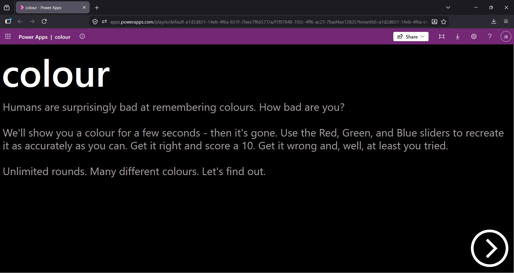
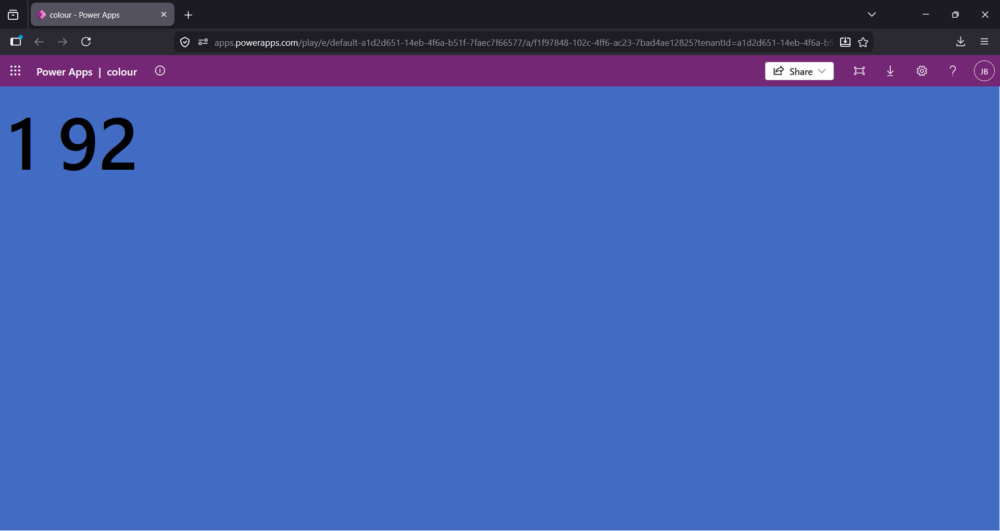
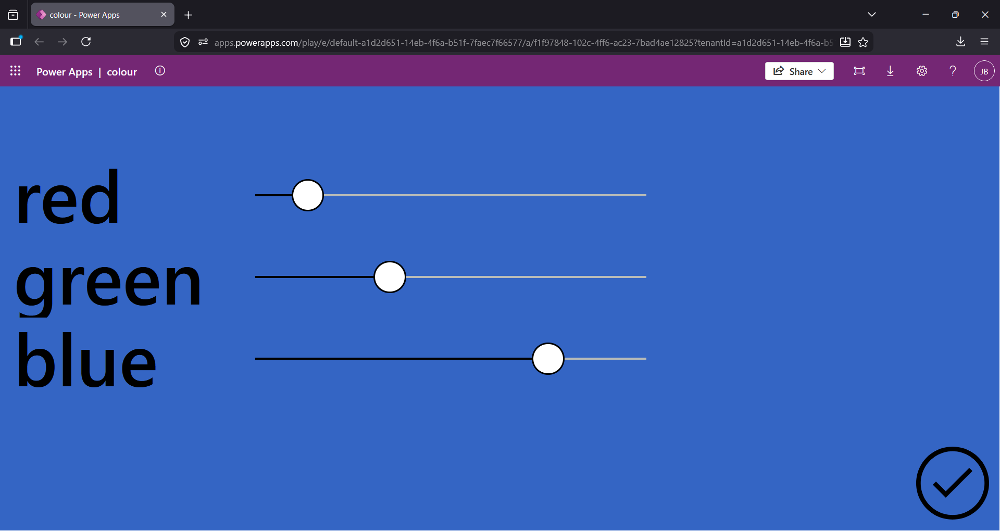
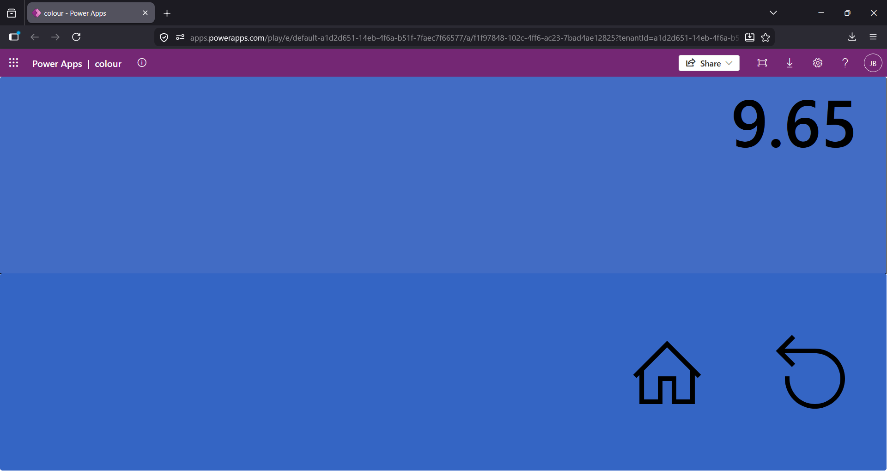

# Colour Memory Game

## Summary

A single player colour memory game built in Power Apps. A random colour appears on screen for a few seconds. The colour disappears and the player uses Red, Green, and Blue sliders to recreate the colour they saw. A score out of 10 is given based on how close the guess was to the original colour.






## Applies to


## Compatibility


## Contributors

* [joshua](https://github.com/brayjosh)

## Version history

Version|Date|Comments
-------|----|--------
1.0|June 8, 2025|Initial release

## Prerequisites

None. No connectors, no Dataverse, no premium licence required.

## Minimal path to awesome

### Using the solution zip

* [Download](./solution/ColourCanvasGame.zip) the `.zip` from the `solution` folder
* Within **Power Apps Studio**, import the solution `.zip` file using **Solutions** > **Import Solution** and select the `.zip` file you just downloaded
* Open the app and select **Play**

### Using the source code

* Clone the repository to a local drive
* Pack the source files back into a solution `.zip` file:

```bash
  pac solution pack --zipfile ColourCanvasGame.zip --folder sourcecode --processCanvasApps
```

* Within **Power Apps Studio**, import the solution `.zip` file using **Solutions** > **Import Solution** and select the `.zip` file you just packed

## Features

A fun and lightweight game that demonstrates creative use of Power Fx and canvas app controls without any external data sources or premium features.

* Random colour generation using `RGBA` and `RandBetween`
* Colour distance scoring using Euclidean distance in RGB space
* Timer controls for countdown and colour display
* Dynamic background colour updated live from slider values

## Help

We do not support samples, but this community is always willing to help, and we want to improve these samples. We use GitHub to track issues, which makes it easy for community members to volunteer their time and help resolve issues.

If you encounter any issues while using this sample, you can [create a new issue](https://github.com/pnp/powerplatform-samples/issues/new?assignees=&labels=Needs%3A+Triage+%3Amag%3A%2Ctype%3Abug-suspected&template=bug-report.yml&sample=colour-canvas-game&authors=@brayjosh&title=colour-canvas-game%20-%20).

For questions regarding this sample, [create a new question](https://github.com/pnp/powerplatform-samples/issues/new?assignees=&labels=Needs%3A+Triage+%3Amag%3A%2Ctype%3Abug-suspected&template=question.yml&sample=colour-canvas-game&authors=@brayjosh&title=colour-canvas-game%20-%20).

Finally, if you have an idea for improvement, [make a suggestion](https://github.com/pnp/powerplatform-samples/issues/new?assignees=&labels=Needs%3A+Triage+%3Amag%3A%2Ctype%3Abug-suspected&template=suggestion.yml&sample=colour-canvas-game&authors=@brayjosh&title=colour-canvas-game%20-%20).

## Disclaimer

**THIS CODE IS PROVIDED *AS IS* WITHOUT WARRANTY OF ANY KIND, EITHER EXPRESS OR IMPLIED, INCLUDING ANY IMPLIED WARRANTIES OF FITNESS FOR A PARTICULAR PURPOSE, MERCHANTABILITY, OR NON-INFRINGEMENT.**

